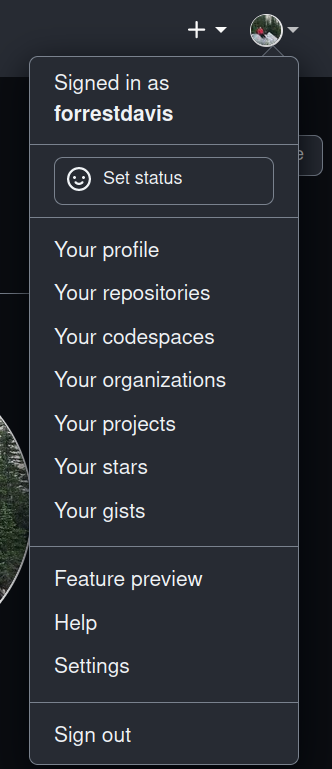
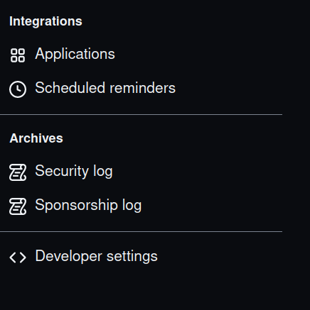
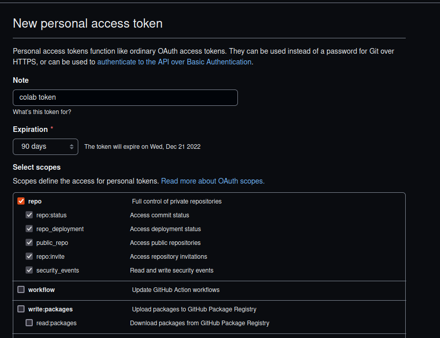
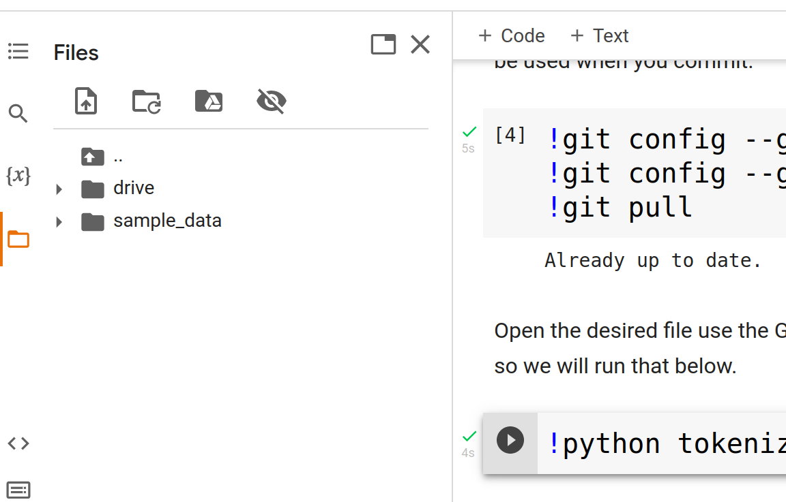
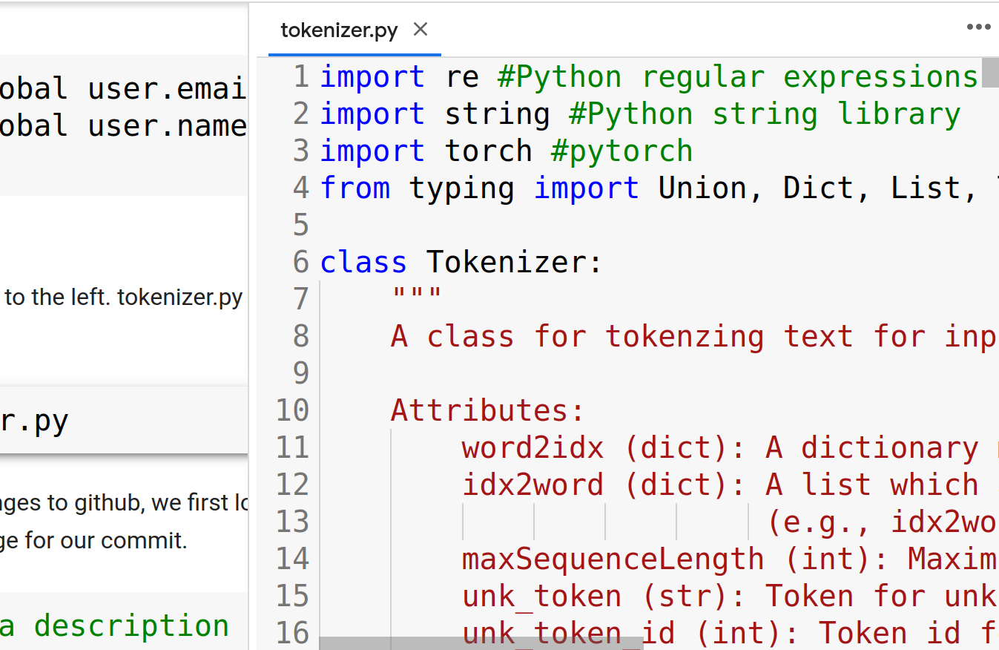

# Interfacing with Github via Colab

This is meant as a brief guide for cloning repos within google drive so that you
can work on code in colab with ease. 

## Adding colab to Google Drive (if you haven't)

If you haven't used colab on your GoogleDrive before you'll need to add it 
to the apps. To do this, within GoogleDrive, right click. You'll see a bunch 
of options for new things you can create. Click "More". If you don't see 
Google Colaboratory click '+ Connect more apps'. Search colaboratory and install
the app. You will now be able to create and use colab notebooks. 

### Basics of colab

Google has a guide for using Colab which you may find useful ([link](https://colab.research.google.com/?utm_source=scs-index)). Essentially, Colab is a way of writing and 
executing Python code directly in your browser. A Colab notebook consists of 
two blocks. 

The first is a text block, where you can annotate your code. It 
use Markdown, which is what this itself is written in. Markdown is a basic markup 
language which lets you write formatted files using plain text files. It's pretty
simple (especially compared to LaTeX). You don't have to dig into it, if you don't 
want to. The text blocks on Colab include shortcuts to most things you might 
be interested in.  

The second type of block is a code block. It is within these that you write 
python code, and you can even execute it. The entire notebook defines 
a workspace, so a function written in one code block can be accessed 
in another code block. 

You should change one setting in colab. Navigate to the settings in the upper
right corner. Then navigate to "Editor" and use the dropdown menu under
"Indentation width in spaces" and select 4. 

### Generating a GitHub access token

To download and edit all the files in your github repository, we need to interact 
directly with github. This is done via an access token. 
First, we need to create a personal access token. To do this, 
got to your github. Navigate to the Settings (see Figure \ref{settings})



Then navigate to "Developer Settings" (see Figure \ref{dev}). 



Once there, navigate to "Personal access tokens". Then click "Generate new token". 
It's helpful to add something like colab token to "Note" so you know what this
token is later. Further, you should said the expiration date for 90 days (which
I think will scope over the whole course) under "Expiration". Finally, click the
repo scope button. You can see all of this in the screen shot below (Figure \ref{access}).



At the very bottom click the "Generate token" button. Write the token down 
somewhere (it will be long and basically a string of random 
stuff). You won't be able to see it once you set it up, so don't lose what you wrote
down (you could always create a new token if you mess this up). Also crucially, 
DO NOT SHARE THIS TOKEN. Don't add it to a file that you push onto github, for example.

### Cloning repo to GoogleDrive

With our token in hand, we can now clone our private repos to github. I've included 
a template colab script to do this ([CloningGitRepo.ipynb](https://github.com/forrestdavis/PublicModelsAPI/blob/main/colab/CloningGitRepo.ipynb)) 
Download this script and add it to your google drive. Then opening the file
should automatically open it in colab. 

Note! Once again, if you edit this to add your 
token, please do not push the changes to github. Below, I go over the components 
of this script. 

To clone the repo, first we "mount" GoogleDrive to our colab instance. That is, 
we make sure we can access our GoogleDrive via colab by typing the following in 
a code block. 

```
from google.colab import drive
drive.mount("/content/drive")
```

This will prompt you to allow colab to access your GoogleDrive. Do so. Next, 
we need to set some variables: 


```
#Should be the same for you
PATH = "/content/drive/MyDrive"

#Additional path to where you want to save your repos
#So for example, on my google drive I save my repos
#under a folder called Projects
#so i would change this variable to 
#"/Projects/"
#include the beginning and trailing '/'
REPOPARENT = "/PATH/TO/PARENT/"

#Name of repo
#This should be the name you see on github for the repo
#for example mine is
REPONAME = "PublicModelsAPI"

#Here just use DavisLingTeaching, so leave this unchanged
#Here you should but your github name (mine is forrestdavis)
GITNAME = 'ADDNAME'

#Git Personal Access Token DO NOT SHARE THIS!
GITTOKEN = "YOUR ACCESS TOKEN"
```
 
Now, we can navigate to where we want to save our repo (PATH+REPOPARENT) 
and clone the repo. Do not change this code, simply run it:

```
#Navigate to place to save repo
%cd "{PATH}{REPOPARENT}"

#Clone repo
!git clone "https://{GITTOKEN}@github.com/{GITNAME}/{REPONAME}.git"
```

We can check that this worked by first navigating to the repo. Again just 
run this code as is:

```
%cd {REPONAME}
```

Then, we check that we have a clone:


```
!git status
```

At the end of this step, you should see your repo on your google
drive. If so, you do not have to run this script again (until you clone another
repo). 

## Setting up the repo so you can run code

Now that you've cloned the repository to your google drive, we can now work with
the actual code. Navigate to the relevant folder on google drive. There
you should see a colab script named colab.ipynb (you can also see it on the repo 
[here](https://github.com/forrestdavis/PublicModelsAPI/blob/main/colab.ipynb)). 
Open this script. 
The top of
that script describes the variables we are going to
set right now. These are all in the first code block and are REPOPATH REPONAME
GITEMAIL and GITNAME. 

The variable BASEPATH should be left unchanged. REPOPATH should give the path on
google drive to your repository. So for example, I've clone PublicModelsAPI in
a folder called Projects. So my REPOPATH variable is 'Projects/'. Critically,
you should end this path with '/' if you are adding something here. If you just
added the repo to drive such that you see it from the home page of google drive
(ie its not under another folder), just put the empty string "" here. 

The REPONAME variable should be the name of the repo (as you see it on github).
So for example, PublicModelsAPI. Finally, set GITEMAIL to the
email you used to create your github account and GITNAME to your github name
(mine is forrestdavis). Run this code block by pressing the play button.     

### Pulling any changes

The next block of code sets some variables and pulls any changes from github (do
not edit this code, simply run it). 

### Running python scripts from within colab

To run the main function: 

```
!python main.py
```

### Using a GPU

If you'd like to run the models on a GPU provided by colab, see this short 
[video](https://github.com/forrestdavis/PublicModelsAPI/blob/main/colab/figures/ColabGPU.gif)
which demonstrates how to give you access to a GPU in colab. Once you have done
this, running the above line of code will run on the GPU automatically. 

### Editing files

To edit a file, navigate to the files on the left of colab (see Figure
\ref{files}). 



Navigate to your folder. Double clicking on a file will open it with
a basic text editor (see Figure \ref{edit}).

{#fig:edit}

Editing this file and saving the changes will update the file on your google
drive. 

